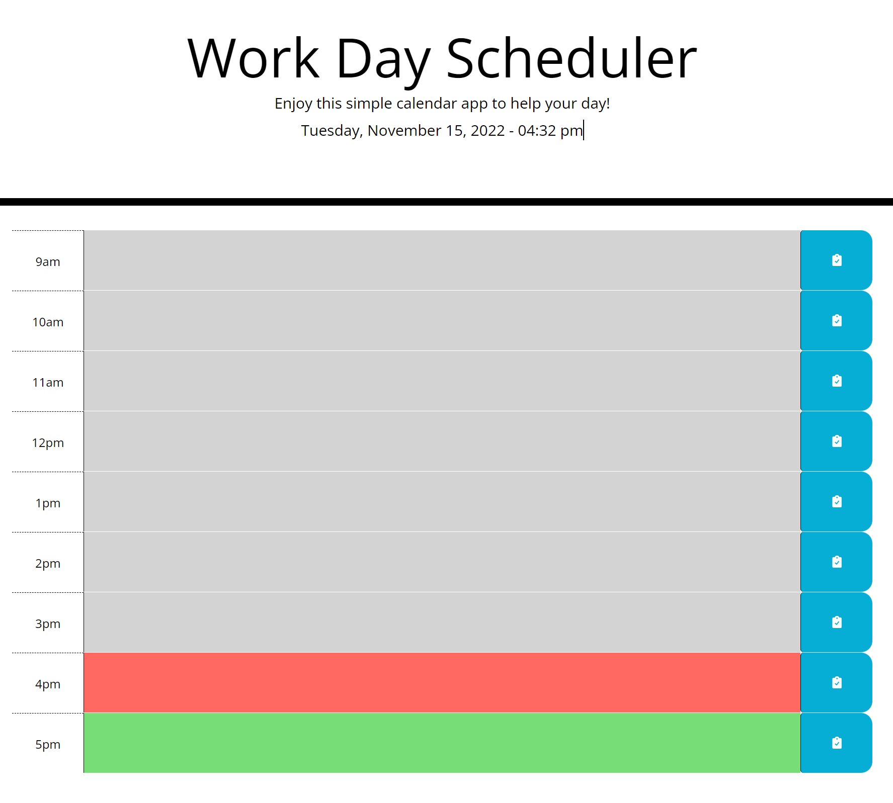

[![Contributors][contributors-shield]][contributors-url]
[![Forks][forks-shield]][forks-url]
[![Stargazers][stars-shield]][stars-url]
[![Issues][issues-shield]][issues-url]
[![MIT License][license-shield]][license-url]

<!-- PROJECT LOGO -->
 

    

  <h3 align="center">Work Day Scheduler README</h3>

  

    Welcome to the Work Day Scheduler README, a great spot to get to know this project!
     
    <a href="https://github.com/danpoggetti/work-day-scheduler"><strong>Explore the docs »</strong></a>
     
     
    <a href="https://danpoggetti.github.io/work-day-scheduler/">View Demo</a>
    ·
    <a href="https://github.com/danpoggetti/work-day-scheduler/issues">Report Bug</a>
    ·
    <a href="https://github.com/danpoggetti/work-day-scheduler/issues">Request Feature</a>
  

<!-- TABLE OF CONTENTS -->

  
Table of Contents

  <ol>
    <li>
      <a href="#about-the-project">About The Project</a>
      <ul>
        <li><a href="#built-with">Built With</a></li>
      </ul>
    </li>
    <li><a href="#getting-started">Getting Started</a></li>
    <li><a href="#usage">Usage</a></li>
    <li><a href="#roadmap">Roadmap</a></li>
    <li><a href="#contributing">Contributing</a></li>
    <li><a href="#license">License</a></li>
    <li><a href="#contact">Contact</a></li>
    <li><a href="#acknowledgments">Acknowledgments</a></li>
  </ol>

<!-- ABOUT THE PROJECT -->
## About The Project

I was tasked to create a work day schedulder app so that a user can help keep track of their daily tasks.

I want a user to be able to:
 
GIVEN I am using a daily planner to create a schedule
WHEN I open the planner
THEN the current day is displayed at the top of the calendar
WHEN I scroll down
THEN I am presented with time blocks for standard business hours
WHEN I view the time blocks for that day
THEN each time block is color-coded to indicate whether it is in the past, present, or future
WHEN I click into a time block
THEN I can enter an event
WHEN I click the save button for that time block
THEN the text for that event is saved in local storage
WHEN I refresh the page
THEN the saved events persist
 

(<a href="#readme-top">back to top</a>)

### Built With

Below are the following technologies and applications utilized to help build the project. 

VS Code 
JavaScript 
HTML 
CSS 

(<a href="#readme-top">back to top</a>)

<!-- GETTING STARTED -->
## Getting Started

Below you'll be able to see screen shots of the deployed app. You can also view the road map to see how you can test it locally.

(<a href="#readme-top">back to top</a>)

<!-- USAGE EXAMPLES -->
## Usage

Here're some screenshots from early ideas of the wireframe. See how we went from initial plans to our full-functioning website.

(<a href="#readme-top">back to top</a>)

<!-- ROADMAP -->
## Roadmap

- [ ] Click the hour you want to add a task
- [ ] Type in what you want to save
- [ ] Click the save icon located to the right in the blue area
- [ ] You can add additional tasks to the different hours of the day
- [ ] If you made a mistake or want to remove a task:
    - [ ] Click the time slot in question to edit
    - [ ] Write in the task or completely delete the text area
    - [ ] Click the save button
    - [ ] This will override the previous task and save to your local drive

See the [open issues](https://github.com/danpoggetti/work-day-scheduler/issues) for a full list of proposed features (and known issues).

(<a href="#readme-top">back to top</a>)

<!-- CONTRIBUTING -->
## Contributing

I strongly feel that contributing well throught and engaging suggestions are instrumental. I am an avid learner and want to let you know any contribution or suggestions are apprecaited.

If you truly believe you can contribute to making this website better, please fork the repo and create a pull request. If you do not wish to fork, you can open and create an issue with the tag "enhancement" or "suggestions". I will then be able to review it and take it into consideration. Lastly, please don't forget to give the project a star!

1. Fork the Project
2. Create your Feature Branch (`git checkout -b feature/newSuggestion`)
3. Commit your Changes (`git commit -m 'Add some NewSuggestion'`)
4. Push to the Branch (`git push origin feature/NewSuggestion`)
5. Open a Pull Request

(<a href="#readme-top">back to top</a>)

<!-- LICENSE -->
## License

Distributed under the MIT License. 
Copyright (c) 2022 Dan Poggetti 
See License.text for more information.

(<a href="#readme-top">back to top</a>)

<!-- CONTACT -->
## Contact

Dan Poggetti - GitHub [https://github.com/danpoggetti]

Project Link: [https://github.com/danpoggetti/work-day-scheduler]

Demo Link: [https://danpoggetti.github.io/work-day-scheduler/]

(<a href="#readme-top">back to top</a>)

<!-- ACKNOWLEDGMENTS -->
## Acknowledgments

I want to acknowledge the many great and vast resouces that aided me in the work day scheduler app.

* [Google](https://www.google.com)
* [YouTube](https://www.youtube.com)
* [GitHub Pages](https://pages.github.com)
* [Dre7283](https://github.com/dre7283)
* [README Template courtesy of othneildrew](https://github.com/othneildrew/Best-README-Template)
* [MIT License text](https://mit-license.org/license.txt)
* [Shields.io for badges](https://shields.io/)

(<a href="#readme-top">back to top</a>)

<!-- MARKDOWN LINKS & IMAGES -->
<!-- https://www.markdownguide.org/basic-syntax/#reference-style-links -->
[contributors-shield]: https://img.shields.io/github/contributors-anon/danpoggetti/work-day-scheduler?style=for-the-badge
[contributors-url]: https://github.com/danpoggetti/work-day-scheduler/graphs/contributors
[forks-shield]: https://img.shields.io/github/forks/danpoggetti/work-day-scheduler?style=for-the-badge
[forks-url]: https://github.com/danpoggetti/work-day-scheduler/network/members
[stars-shield]: https://img.shields.io/github/stars/danpoggetti/work-day-scheduler?style=for-the-badge
[stars-url]: https://github.com/danpoggetti/work-day-scheduler/stargazers
[issues-shield]: https://img.shields.io/github/issues/danpoggetti/work-day-scheduler?style=for-the-badge
[issues-url]: https://github.com/danpoggetti/work-day-scheduler/issues
[license-shield]: https://img.shields.io/github/license/danpoggetti/work-day-scheduler?style=for-the-badge
[license-url]: https://github.com/danpoggetti/work-day-scheduler/blob/main/LICENSE
[product-screenshot]: images/screenshot.png